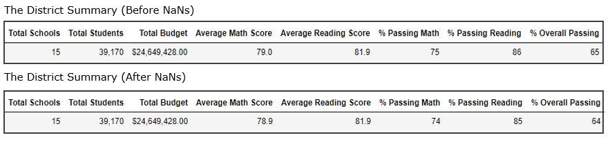
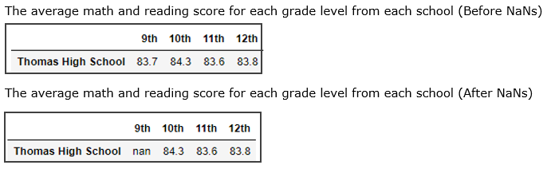
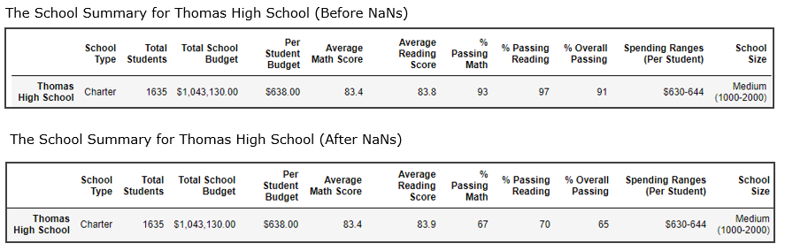
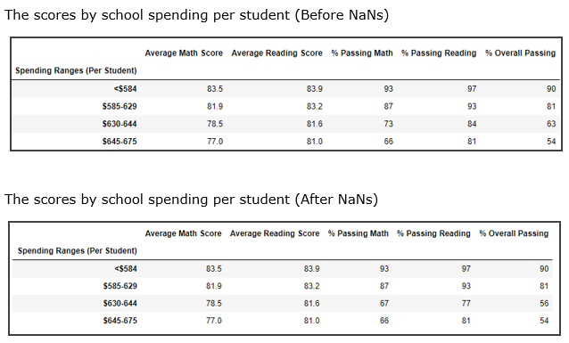
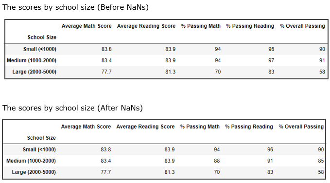
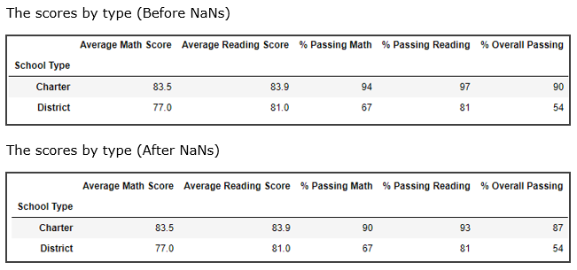

# School District Analysis
*Python Pandas school district analysis*

## Project Overview 
### Purpose

The purpose of this analysis is to aggregate the students’ and schools’ datasets and analyze data on students’ standardized math and reading scores from various schools in the selected districts. To showcase trends in school performance, the analysis focuses on the following.

1. The district summary, which includes the total number of students, the total number of schools, total budget, total math and reading averages, and total math, reading, and overall passing percentages.
2. The school summary, which includes, school type, number of students, school budget, average math and reading scores and math, reading, and overall passing percentages for each school.
3. The top 5 and bottom 5 performing schools, based on the overall passing rate.
4. The average math and reading scores for each grade level (9th, 10th, 11th and 12th) from each school.
5. The math and reading scores grouped by
    - spending ranges per students,
    - school size and,
    - school type.

The analysis will assist the school board and superintendent in making decisions regarding the school budgets and priorities.

### Background 

The data is gathered in two different CSV files (school data and student data). This is raw data that has to be transformed in order to perform analysis and convey information. Those steps are performed in the so-called **data-wrangling** or **data-munging** process and include the following.

  - Load and read raw data.
  - Inspect data (finding anomalies, finding missing values, declare data types, etc)
  - Clean date (leave, replace or delete the row with missing values)
  - Merge datasets.
  - Perform calculations and create tables.
  - Change layout and structure (organized tables are key to represent data in a way that is easy to understand and easy to detect patterns and correlation).
  - Sorting and grouping data (it is in our power - data analysts - to use analytical mind and represent data in a new way. Grouping data in well-defined categories can make a big difference in story-telling of the data).

## Resources

Data Source |Software|Environment|Dependencies 
---|---|---|---
   [schools_complete.csv](Resources/schools_complete.csv)   [students_complete.csv](Resources/students_complete.csv) |  Jupyter Notebook 6.0.3 | Python 3.7. &nbsp; &nbsp;   | Pandas Library 1.0.5  &nbsp; &nbsp;    NumPy Library 1.17.0 &nbsp; &nbsp; 

## Results

There was evidence of academic dishonesty for math and reading scores in Thomas High School for ninth graders, therefore the school board wants to uphold state-testing standards for this school only. The grades for math and reading in Thomas High School, 9th grade will be replaced with NaNs while keeping the rest of the data intact. In the analysis below are results and comparison from both analyses before and after replacements the grades with NaNs.

:exclamation: **Replacing the missing values with NaN.** NaN stands for “not a number”. In performing calculations, unlike 0 (zero) NaNs are not considered in the sum, or the averages; therefore, missing values won’t have an impact. But we need to be careful if we multiply or divide row with NaNs. The answer, in this case, will be NaN(1).

It is important to know the properties of those replacements for values in order to make the right decision about handling missing values and other anomalies in the data sets. 

Results below (see the pictures “After NaNs”) reflects how NaNs work in the data set. NaNs are not included in the sums or the average calculations. Another point to pay attention is when we need to count total rows, for example, *“student names”*. We could take any column and count the rows, yet it is a good practice to take the row that has all the information and inspect data before calculations.

 
  

 
*info() function cohesively displays information about the data set* From the column reading_score and math_score we can see the NaN values weren’t included in the calculations. 

**1. The district summary.** 
In this summary, almost all results were impacted by NaNs. Data from Thomas High School 9th grade were included in the following calculations:
  - average math and reading score
  - passing math and reading percentage
  - overall passing percentage 
(please refer to DataFrame below for numerical results.)

  - results for the total number of schools, the total number of students, and the total budget were not affected and stayed unchanged since the calculations with NaN values weren’t included.
  

  
<kbd>    

</kbd>

**2. The average math and reading scores for each grade level from each school.** 
In this report, only grades from Thomas High school in 9th grade was affected for math and reading.
  - Calculations in this analysis are performed separately for each class and each school; therefore, calculations weren’t affected. In the picture below are results before and after NaNs.  
  

 
<kbd>    
 
<kbd>

**3. The School Summary.** 
In this summary, only results from Thomas High School were impacted by NaNs, other school results remained unchanged. Result impacted by NaNs:
  - average math and reading score
  - passing math and reading percentage
  - overall passing percentage 
  
(please refer to DataFrame below for numerical results.)

<kbd>    

</kbd>

- Other school results remained unchanged. 
(please see the full report here: 

[The School Summary Before NaNs](Results/TheSchoolSummaryBeforeNaNs.pdf)

[The School Summary After NaNs](Results/TheSchoolSummaryAfterNaNs.pdf)

**4. The top 5 and bottom 5 performing schools, based on the overall passing rate.**
  - The overall rating for Thomas High School changed from 91% to 65% and the school rank dropped from 2nd place to 8th place after changing scores with NaNs.

**5. School performance based on the budget per student.**
  - From the Data Frame above (The School Summary) we can see that Thomas High school falls into a category *spending range per students $630-$644*. 
  - Calculations for categories or bins are made for bins specifically;  therefore, scores in this summary are affected only within a category with NaNs. 
(please refer to DataFrame below for numerical results.)

<kbd>
 
</kbd>

**6. School performance based on the school size.**
  - From the Data Frame above (The School Summary) we can see that Thomas High school falls into a category *medium size schoo (1000 - 2000)*. 
  - Calculations for categories are made for those bins specifically;  therefore, scores in this summary are affected only within a category with NaNs. 
(please refer to DataFrame below for numerical results.)

<kbd>   
 
</kbd>

**7. School performance based on the type of school.**
  - From the Data Frame above (The School Summary) we can see that Thomas High school falls into a category *Charter*. 
  - Calculations for categories are made for those bins specifically;  therefore, scores in this summary are affected only within a category with NaNs. 
(please refer to DataFrame below for numerical results.)

  
<kbd>
 
</kbd>

### Overview of the methods and code
Python’s Library **Pandas** are very flexible and easy to manipulate. There are lots of information about Pandas on the web, [Pandas User Guide - official documentation](https://pandas.pydata.org/docs/user_guide/index.html#user-guide), for example. Yet on the link below, I have included some of the Pandas commands that I used in this analysis.

[Pandas Cheat Sheet](Results/PandasCheatSheet.pdf)

## Summary 
Since Thomas High School math and reading grades for 9th graders were replaced with NaNs, there are some major changes in the report. 
1. The biggest change is on the math and reading scores for  9th graders itself. No data is available for those. 
2. The second largest change is the school summary, for Thomas High School specifically. Overall passing percentage went from 91% to 65%, Passing math and reading percentage went from 93% and 97% to 67% and 70% respectively. Since the calculations were made per school specifically no other schools’ results were affected by grade replacement.
3. Next, the overall passing percentage went from 65% to 64% after the grades were replaced by NaNs.
4. There were some changes in school summaries by spending per student, size, and type. Again, only categories that include Thomas High School were affected. Categories that were affected are: *Spending Ranges (Per Student) $630-644*, *Medium size schools (1000-2000) students* and *The Charter schools*.

## References 
Module 4: PyCitySchools: Handle Missing Data: https://courses.bootcampspot.com/courses/200/pages/4-dot-5-2-handle-missing-data?module_item_id=57674, Web 6 Aug 2020.

## Other useful articles
- [Exploratory Data Analysis - Wiki](https://en.wikipedia.org/wiki/Exploratory_data_analysis)

- [Exploratory Data Analysis](https://medium.com/datadriveninvestor/introduction-to-exploratory-data-analysis-682eb64063ff)

- [Pandas User Guide](https://pandas.pydata.org/docs/user_guide/index.html#user-guide)

- [export CSV from Pandas](https://towardsdatascience.com/how-to-export-pandas-dataframe-to-csv-2038e43d9c03)

- [determing your current environment](https://docs.conda.io/projects/conda/en/latest/user-guide/tasks/manage-environments.html)
