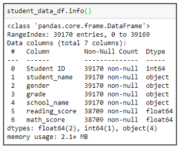

# School District Analysis
*Python Pandas school district analysis*

## Project Overview 
### Purpose

The purpose of this analysis is to aggregate the students’ and schools’ datasets and analyze data on students’ standardized math and reading scores from various schools in the selected districts. To showcase trends in school performance, the analysis focuses on the following.

1. **The district summary**, which includes the total number of students, the total number of schools, total budget, math and reading averages, and math, reading, and overall passing percentages.
2. **The school summary**, which includes, school type, number of students, school budget, average math and reading scores and math, reading, and overall passing percentages for each school.
3. The **top 5** and **bottom 5 performing schools**, based on the overall passing rate.
4. The **average math and reading scores** for each grade level (9th, 10th, 11th and 12th) from each school.
5. The math and reading scores grouped by
    - **spending ranges per students**,
    - **school size** and,
    - **school type**.

The analysis will assist the school board and superintendent in making decisions regarding the school budgets and priorities.

### Background 

The data is gathered in two different CSV files (school data and student data). This is raw data that has to be transformed in order to perform analysis and convey information. Those steps are performed in the so-called **data-wrangling** or **data-munging** process and include the following.

  - Load and read raw data.
  - Inspect data (finding anomalies, finding missing values, declare data types, etc).
  - Cleaning data (leave, replace or delete rows with missing values).
  - Merge datasets.
  - Perform calculations and create tables.
  - Change layout and structure (organized tables are key to represent data in a way that is easy to understand and easy to detect patterns and correlations).
  - Sorting and grouping data (it is in data analysts power to use analytical mind and represent data in a new way. Grouping data in well-defined categories can make a big difference in story-telling of the data).

## Resources

- Data Source: 
  - [schools_complete.csv](Resources/schools_complete.csv)
  - [students_complete.csv](Resources/students_complete.csv)

- Software: 
  - Jupyter Notebook 6.0.3 

- Environment: 
  - Python 3.7. 
- Dependencies:
  - Pandas Library 1.0.5 
  - NumPy Library 1.17.0 

## Results
### Foreword

There was an evidence of academic dishonesty for math and reading scores in **Thomas High School for ninth graders**; therefore, the school board wants to uphold state-testing standards for this school only. The grades for math and reading in Thomas High School, 9th grade will be **replaced with NaNs** while keeping the rest of the data intact. In the analysis below is the comparison from both analyses before and after the replacement the grades with NaNs.

:exclamation: **Replacing the missing values with NaNs.**

NaN stands for “not a number”. In performing calculations, unlike 0 (zero) NaNs are not considered in the sum, or the averages; therefore, missing values don't have an impact. Yet we need to be careful if we multiply or divide rows with NaNs, because the answer, in this case, will be NaN(1). It is important to know those properties in order to make the right decision about handling missing values and other anomalies in the data sets. 

**info() function** - in the picture below - cohesively displays information about the data set. From the column reading_score and math_score we can see the NaN values weren’t included in the calculations. This is another point to pay attention. When we need to count total rows, for example, *“student names”*, We could take any column and count the rows, yet it is a good practice to take the row that has all the information and inspect data before calculations.

 
  

### Analysis
**1. The district summary.**
   - In this summary, almost all results were impacted by NaNs. Data from Thomas High School 9th grade were included in the following calculations.
   - Average math and reading score (dropped from 79.0 and 81.9 to 78.9 to 81.9, respectively).
   - Passing math and reading percentage (dropped from 75 and 86 to 74 and 85 respectively).
   - Overall passing percentage (dropped from 65 to 64).
   - Results for the total number of schools, the total number of students, and the total budget were not affected and stayed unchanged since the calculations with NaN values         weren’t included.
  

  
<kbd>    

</kbd>

Data Frame from analysis The district summary before and after replacement grades with NaNs.

**2. The average math and reading scores for each grade level from each school.**
   - In this report, only grades from Thomas High school in 9th grade was affected for math and reading. 
   - Calculations in this analysis are performed separately for each class and each school; therefore, other graders and schools weren’t affected.  
    

 
<kbd>    
 
<kbd>

    

Data Frame from analysis The average math and reading scores for each grade level from each school before and after replacement grades with NaNs. 

**3. The School Summary.** 

   - In this summary, only results from Thomas High School were affected by NaNs, other schools' results remained unchanged.
   - Average math and reading scores remained unchanged.
   - Passing math and reading percentage (dropped from 93 and 97 to 67 and 70 respecitvely).
   - Overall passing percentage (dropped from 91 to 65).
  

<kbd>    

</kbd>

Data Frame from analysis The School Summary for Thomas High School before and after replacement grades with NaNs. 

   - Other schools' results remained unchanged. In the link we can see full report from all schools -  [The School Summary Before NaNs](Results/TheSchoolSummaryBeforeNaNs.pdf) and [The School Summary After NaNs](Results/TheSchoolSummaryAfterNaNs.pdf).

**4. The top 5 and bottom 5 performing schools, based on the overall passing rate.**
  - The overall rating for Thomas High School changed from 91% to 65%.
  - The school rank dropped from 2nd place to 8th place after changing scores with NaNs.

**5. School performance based on the budget per student.**
  - From the Data Frame above (The School Summary) we can see that Thomas High school falls into a category *spending range per students $630-$644*. 
  - Calculations are made separately for those categories; therefore, scores in this summary are affected only within a category with NaNs. 
  - Average math and reading scores remained unchanged.
  - Passing math and reading percentage (dropped from 73 and 84 to 67 to 77 respecitvely).
  - Overall passing percentage (dropped from 63 to 56).
  

<kbd>
 
</kbd>

Data Frame from analysis School performance based on the budget per student before and after replacement grades with NaNs. 

<kbd>   
 
</kbd>

Data Frame from analysis School performance based on the school size before and after replacement grades with NaNs. 

  
<kbd>
 
</kbd>

Data Frame from analysis School performance based on the type of school. before and after replacement grades with NaNs. 

### Overview of the methods and code
Python’s Library **Pandas** are very flexible and easy to manipulate. There are a lot of information about Pandas on the web for example, [Pandas User Guide - official documentation](https://pandas.pydata.org/docs/user_guide/index.html#user-guide) where we can find how specifinc commands works. Yet on the link below, I have included Pandas commands that I used in this analysis.

[Pandas Cheat Sheet](Results/PandasCheatSheet.pdf)

## Summary 
Since Thomas High School math and reading grades for 9th graders were replaced with NaNs, there are some major changes in the report. 
1. The biggest change is on the math and reading scores for 9th graders itself. No data is available for those and instead of numeric values we can see NaN. 
2. The second largest change is in the school summary, for Thomas High School specifically. Overall passing percentage went from 91% to 65%, Passing math and reading percentage went from 93% and 97% to 67% and 70% respectively. Since the calculations were made per school specifically no other schools’ results were affected by grade replacement.
3. Next, the overall passing percentage went from 65% to 64% after the grades were replaced by NaNs.
4. There were some changes in school summaries by spending per student, size, and type. Again, only categories that include Thomas High School were affected. Categories that were affected are: *Spending Ranges (Per Student) $630-644*, *Medium size schools (1000-2000) students* and *The Charter schools*.

## References 
Module 4: PyCitySchools: Handle Missing Data: https://courses.bootcampspot.com/courses/200/pages/4-dot-5-2-handle-missing-data?module_item_id=57674, Web 6 Aug 2020.

## Other useful articles
- [Exploratory Data Analysis - Wiki](https://en.wikipedia.org/wiki/Exploratory_data_analysis)

- [Exploratory Data Analysis](https://medium.com/datadriveninvestor/introduction-to-exploratory-data-analysis-682eb64063ff)

- [Pandas User Guide](https://pandas.pydata.org/docs/user_guide/index.html#user-guide)

- [export CSV from Pandas](https://towardsdatascience.com/how-to-export-pandas-dataframe-to-csv-2038e43d9c03)

- [determing your current environment](https://docs.conda.io/projects/conda/en/latest/user-guide/tasks/manage-environments.html)
